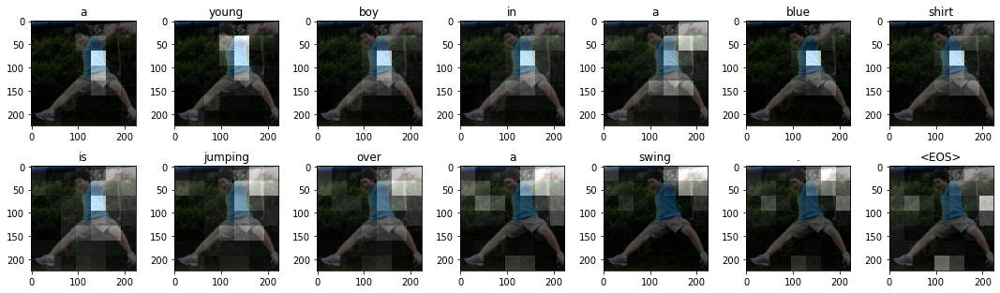
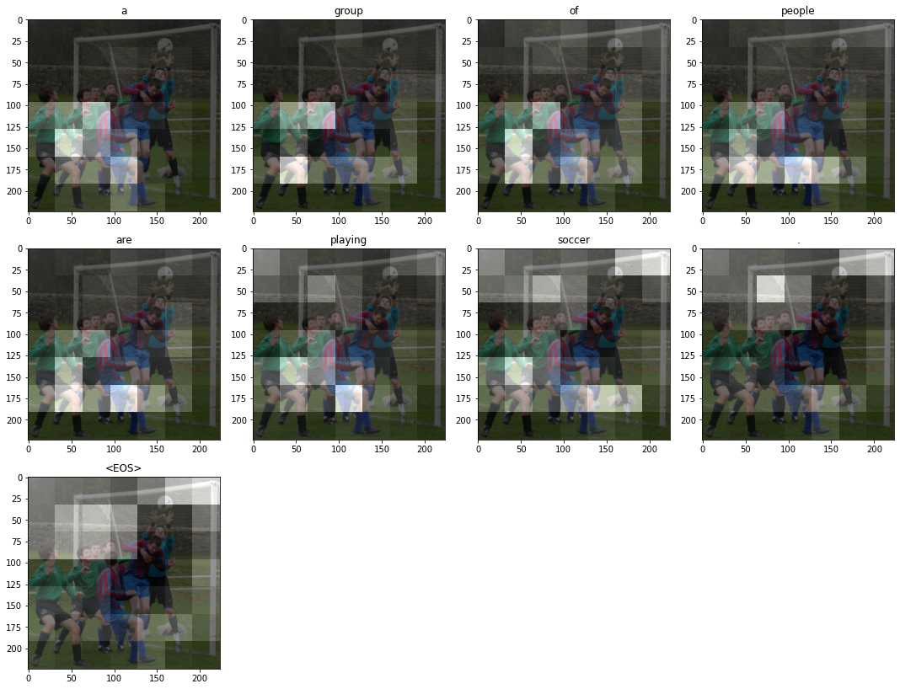
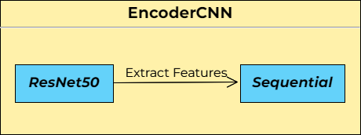

[](https://classroom.github.com/a/sPgOnVC9)
[](https://classroom.github.com/online_ide?assignment_repo_id=11106514&assignment_repo_type=AssignmentRepo)

---

# XNAP-Image Captioning
**The goal of this project is to build a model that generates a caption from an image.**

We implemented a Seq2Seq architecture, which consists of an Encoder and a Decoder. The Encoder uses the pre-trained Convolutional Neural Network ResNet50 to extract the relevant features of the images, which are then passed to the Decoder, which uses a Recurrent Neural Network (an LSTM, in particular), together with an attention mechanism, to produce the captions.

The neural net uses an attention mechanism to focus on the important information for each word, which can be visualized.





The base code comes from this [Kaggle Notebook](https://www.kaggle.com/code/mdteach/image-captioning-with-attention-pytorch), by Abishek Bashyal, and the goal of this project is to implement in an ordered way all the necessary functions and classes in Python files, as well as to throughouly document and evaluate the main mechanisms behind the implemented Seq2Seq architecture. Also, we provide an optimized version of the code, much faster and with carefully chosen hyperparameters.

## Model overview
The Seq2Seq architecture has two main layers, as we already mentioned, Encoder and Decoder. We will explain each layer and its composition in detail.

### Preprocessing
Prior to any of these there is the preprocessing of the [dataset](https://github.com/DCC-UAB/xnap-project-matcad_grup_10#Data). The given data, as we explain later, consists of a picture in jpg format and 5 captions for each one. 

Firstly we need to tokenize the captions to create a vocabulary for the model. It is also necessary to process the captions as numbers, which is the computer's language. Special tokens are also added: start of sentence `<SOS>`, end of sentence `<EOS>`, unknown `<UNK>` and padding `<PAD>` (to make all input captions the same length).

Images also need to change its format in order to be used in the ResNet50, ResNet152, GoogleNet or VGG, which has to be (224, 224), so they experience size transformations to fit into this format.

### Encoder
The first layer, responsible of extracting the main features out of the image, uses a pre-trained net such as ResNet50, ResNet152, GoogleNet or VGG, which will be then transformed in a sequential net. 



The sequential net sets the right format to the data extracted by the previous net, in order to be used in the Decoder.

### Decoder

## Code structure
The code structure is as follows:
- environment.yml: Includes the code dependencies
- /SRC: Contains the source code files
  - main.py: Starting point of the code
  - train.py: Contains the train functions
  - test.py: Contains the test function
  - EDA.ipynb: Notebook with exploratory visualizations of the data
  - Visualization.ipynb: Notebook with visualization of the model
  - /models: Custom library
    - models.py: Contains the models used in the project
  - /utils: Custom library
    - utils.py: Includes utility functions used throughout the codebase
    - visualizations.py: Includes visualization functions used in the notebooks

## Data
The database used to train the model comes from this [Kaggle Dataset](https://www.kaggle.com/datasets/adityajn105/flickr8k), by Aditya Jain, which contains +8k images from the social network Flickr with 5 captions per image. The images represent diverse situations, from kids playing in a playground to landscapes. In order to have a deeper understanding of the used data please check the [Exploratory Data Analysis](https://github.com/DCC-UAB/xnap-project-matcad_grup_10/blob/main/SRC/EDA.ipynb).

POSAR ALGUNA FOTO DEL POWER

## Execution

FER UN PAS A PAS, AMB EL ENVIRONMENT I LES COMANDES.

## Example Code
The given code is a simple CNN example training on the MNIST dataset. It shows how to set up the [Weights & Biases](https://wandb.ai/site)  package to monitor how your network is learning, or not.

Before running the code you have to create a local environment with conda and activate it. The provided [environment.yml](https://github.com/DCC-UAB/xnap-project-matcad_grup_10/environment.yml) file has all the required dependencies. Run the following command: ``conda env create --file environment.yml `` to create a conda environment with all the required dependencies and then activate it:
```
conda activate xnap-example
```

To run the example code:
```
python main.py
```


## Contributors
- Alejandro Donaire: aledonairesa@gmail.com | https://www.linkedin.com/in/alejandro-donaire

- Èric Sánchez: ericsanlopez@gmail.com | www.linkedin.com/in/ericsanlopez

- Pau Ventura: pau.ventura.rodriguez@gmail.com | https://www.linkedin.com/in/pauvr

Xarxes Neuronals i Aprenentatge Profund
Grau de __Computational Mathematics & Data analyitics__, 
UAB, 2023
